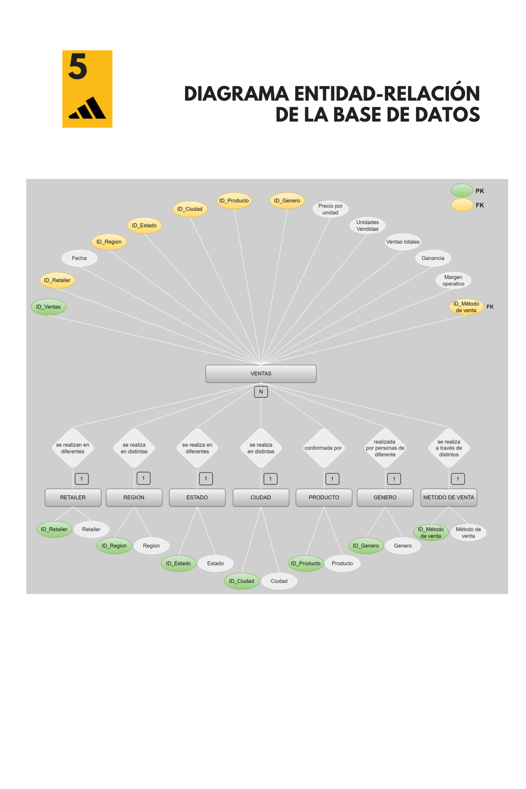
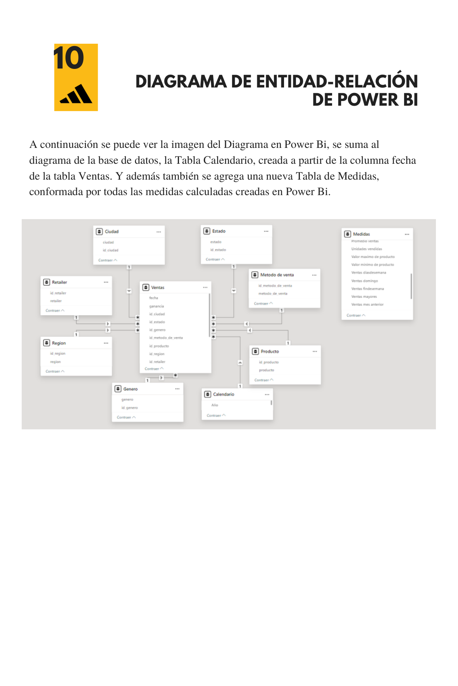
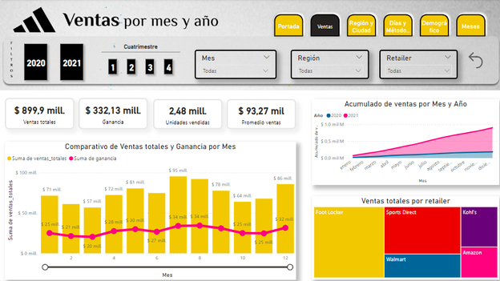
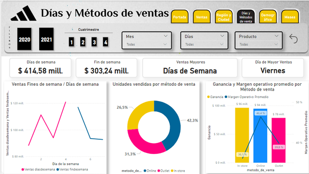
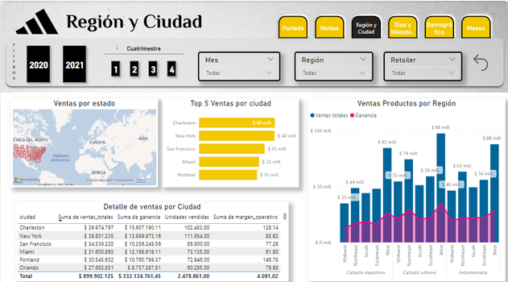
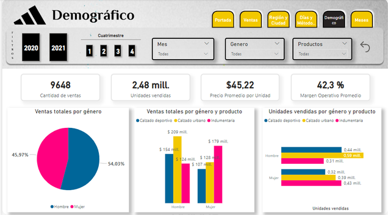
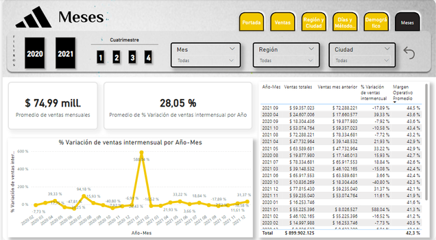

# Análisis de Ventas de Adidas US (2020-2021)

Proyecto final del curso de Data Analytics (Coderhouse). Análisis end-to-end de ventas de Adidas en Estados Unidos: modelado de datos, dashboard interactivo en Power BI y validación de hipótesis de negocio.

**Dataset:** [Adidas US Sales Datasets](https://www.kaggle.com/) (Kaggle) — ventas 2020-2021.

---

## 1. Objetivo

Analizar el comportamiento de ventas de Adidas en Estados Unidos para identificar patrones geográficos, estacionales, demográficos y por canal de venta, con el fin de aportar información accionable a los equipos de Ventas, Marketing, Operaciones, Finanzas y Producto.

## 2. Preguntas de negocio (hipótesis)

Antes de tocar los datos, se plantearon 5 hipótesis a validar o refutar:

| # | Hipótesis | Resultado |
|---|-----------|-----------|
| 1 | Las ventas varían significativamente entre regiones | ✅ Confirmada — la región **West** supera ampliamente al resto |
| 2 | El canal online tiene mayor volumen, pero la tienda física mayor margen | ✅ Confirmada |
| 3 | El público femenino consume más que el masculino | ❌ Refutada — el volumen es similar, pero cambia la **preferencia de producto** (mujeres → indumentaria, hombres → calzado urbano) |
| 4 | Mayo (Día de la Madre) y diciembre (fiestas) muestran picos de venta | ⚠️ Parcial — se cumple en 2021, no en 2020 |
| 5 | Los fines de semana facturan más que los días de semana | ❌ Refutada — los días de semana facturan más, y el **viernes** es el día de mayor venta |

## 3. Usuarios finales

El análisis se diseñó pensando en 4 audiencias dentro de la empresa: Directores de Ventas y Marketing, Gerentes de Operaciones, Equipos de Finanzas y Equipos de Producto — combinando una vista **operativa** (día a día) y una **táctica** (mensual/estacional).

## 4. Modelo de datos

Esquema estrella: una tabla de hechos (`Ventas`) conectada a 7 tablas de dimensión (Retailer, Región, Estado, Ciudad, Producto, Género, Método de venta).



En Power BI se sumó una tabla de Calendario (generada a partir de la fecha) y una tabla de Medidas con todo el DAX del proyecto:



## 5. Proceso y herramientas

| Etapa | Herramienta |
|---|---|
| Lectura y limpieza inicial del dataset | Excel |
| Modelado de datos (tablas, claves primarias/foráneas) | SQL Server |
| Diagrama entidad-relación | [draw.io](https://app.diagrams.net/) |
| Diseño de los lienzos del dashboard | Figma |
| Documentación del proyecto | Canva |
| Construcción del tablero de control | Power BI Desktop |

## 6. Transformaciones y medidas DAX

**Limpieza y transformación (Power Query):**
- Eliminación de filas nulas en las tablas `Región` y `Retailer`.
- Conversión de todos los IDs (decimal → texto) en las 7 tablas de dimensión y en la tabla `Ventas`, para que Power BI las trate como claves y no como valores numéricos agregables.
- Creación de la tabla `Calendario` a partir de la columna `fecha` de `Ventas`, con columnas calculadas: Año, Mes, Día, Cuatrimestre, Día de la semana y Año-Mes.

**Medidas DAX principales** (tabla `Medidas`, ~20 medidas en total). Algunos ejemplos representativos:

```dax
Ventas totales = SUM('Ventas$'[ventas_totales])

Ventas findesemana =
CALCULATE([Ventas Totales], FILTER(Calendario, Calendario[Dia de la semana] in {5,6,7}))

Ventas diasdesemana =
CALCULATE([Ventas Totales], FILTER(Calendario, Calendario[Dia de la semana] in {1,2,3,4}))

% Variación de ventas intermensual =
IF([Ventas mes anterior] = 0, BLANK(), ([Ventas totales] - [Ventas mes anterior]) / [Ventas mes anterior])

Día Mayor Ventas =
VAR DiaNumero =
    CALCULATE( MAX(Calendario[Dia de la semana]),
        FILTER( Calendario, [Ventas por Día] = MAXX(ALL(Calendario), [Ventas por Día]) ))
RETURN
    SWITCH(DiaNumero, 1,"Lunes", 2,"Martes", 3,"Miércoles", 4,"Jueves", 5,"Viernes", 6,"Sábado", 7,"Domingo", "Desconocido")
```

Estas dos últimas medidas (`Ventas findesemana`/`diasdesemana` y `Día Mayor Ventas`) son las que permitieron refutar la hipótesis de los fines de semana con evidencia concreta, en vez de una impresión visual del gráfico.

## 7. Dashboard

El tablero tiene 6 solapas navegables, cada una filtrable por año, cuatrimestre, mes, región, retailer, producto o ciudad según corresponda.

**Portada**


**Ventas por mes y año** — ventas totales, ganancia, unidades vendidas, comparativo interanual y ranking de retailers.



**Región y ciudad** — mapa de ventas por estado, top 5 ciudades, y ventas/ganancia por categoría de producto y región.



**Días y métodos de venta** — comportamiento según día de semana vs. fin de semana, y distribución por canal (in-store, outlet, online).



**Demográfico** — ventas y unidades por género, cruzadas con categoría de producto.



**Meses** — variación intermensual de ventas y detalle mes a mes de todo el período analizado.



## 8. Conclusiones principales

- La región **West** concentra la mayor facturación, muy por encima del resto.
- El canal **online** mueve más volumen, pero la **tienda física** deja mejor margen — vale la pena repensar cómo balancear ambos canales en vez de priorizar uno solo.
- Las preferencias de producto difieren fuerte por género: indumentaria lidera en mujeres, calzado urbano en hombres. Esto es más accionable para marketing que "un género compra más que el otro".
- La estacionalidad de mayo/diciembre no es uniforme entre 2020 y 2021 — probablemente por el contexto de pandemia — lo que sugiere que las campañas de fechas clave necesitan planificarse año a año, no asumir un patrón fijo.
- El viernes es el pico de ventas de la semana, y en general los días de semana superan al fin de semana — un dato contraintuitivo con implicancias directas para dotación de personal y stock.

**Líneas futuras:** desagregar más los tipos de producto para un análisis de género más granular, cruzar los meses atípicos con calendario real de campañas/promociones, y estudiar cómo optimizar en conjunto el canal online (volumen) y el físico (margen).

## 9. Contenido del repositorio

```
├── README.md
├── adidas-us-sales-dashboard.pbix   # Dashboard completo en Power BI
├── adidas-us-sales-dashboard.pdf    # Documentación completa del proyecto
├── Adidas_US_Sales_Datasets.xlsx    # Dataset original (Kaggle)
└── screenshots/                     # Capturas del ERD y del dashboard
```

> El archivo `.pbix` requiere [Power BI Desktop](https://powerbi.microsoft.com/desktop/) (gratuito) para abrirse de forma interactiva.

**Documentación completa del proceso:** [adidas-us-sales-dashboard.pdf](adidas-us-sales-dashboard.pdf)

---

**Autora:** Virginia Helvig · [LinkedIn](https://www.linkedin.com/in/virginia-elizabeth-helvig/) · Coderhouse — Curso de Data Analytics
